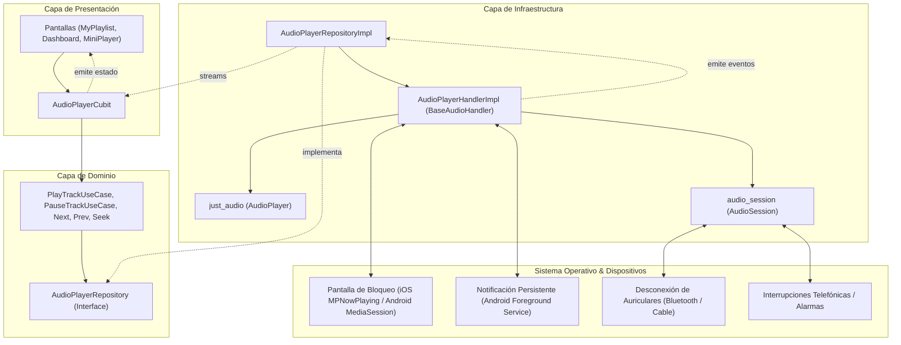

# Arquitectura y Guía Técnica: Reproducción de Audio en Segundo Plano y Pantalla Bloqueada

Este documento detalla la implementación, arquitectura y configuración del sistema de reproducción de audio en segundo plano (Background Audio Playback) con controles en pantalla de bloqueo y barra de notificaciones para la aplicación **Media Player**.

---

## 1. Arquitectura de Alto Nivel y DDD

El sistema respeta estrictamente la arquitectura **Domain-Driven Design (DDD)** y la gestión reactiva con **BLoC/Cubit**, aislando los servicios de plataforma en la capa de infraestructura sin contaminar el dominio ni la presentación.



### Separación de Responsabilidades

1. **Dominio (`lib/domain/`)**:
   - Define las entidades puras (`Track`, `Playlist`, `AudioRepeatMode`).
   - Define el contrato abstracto `AudioPlayerRepository` con flujos reactivos (`isPlayingStream`, `positionStream`, `durationStream`, `currentTrackStream`, `repeatModeStream`).
2. **Aplicación (`lib/application/`)**:
   - Contiene los casos de uso atómicos (`PlayTrackUseCase`, `PauseTrackUseCase`, `NextTrackUseCase`, etc.).
3. **Infraestructura (`lib/infrastructure/`)**:
   - `AudioPlayerHandlerImpl` (`lib/infrastructure/services/audio_player_handler.dart`): Implementa `BaseAudioHandler` con `SeekHandler` y `QueueHandler` de `audio_service`, encapsula el motor de audio `just_audio` y el gestor de foco `audio_session`.
   - `AudioPlayerRepositoryImpl` (`lib/infrastructure/repositories/audio_player_repository_impl.dart`): Orquesta el acceso a datos locales y delega la reproducción y controles remotos a `AudioPlayerHandlerImpl`.
4. **Presentación (`lib/presentation/`)**:
   - `AudioPlayerCubit` consume únicamente casos de uso y el repositorio de dominio. Se suscribe a los flujos y reacciona de forma unidireccional a los cambios de estado (tanto si se originan en la UI como en los controles externos de la pantalla de bloqueo). Cero llamadas a `setState()`.

---

## 2. Configuración de Plataforma

### 2.1 Android

En Android, la reproducción en segundo plano se gestiona mediante un **Foreground Service** con notificación persistente, compatible con Android 8.0+ (API 26+) y Android 14+ (API 34+):

#### Permisos y Servicio en `android/app/src/main/AndroidManifest.xml`:
```xml
<uses-permission android:name="android.permission.WAKE_LOCK" />
<uses-permission android:name="android.permission.FOREGROUND_SERVICE" />
<uses-permission android:name="android.permission.FOREGROUND_SERVICE_MEDIA_PLAYBACK" />

<application ...>
    <!-- Foreground service de audio_service -->
    <service
        android:name="com.ryanheise.audioservice.AudioService"
        android:foregroundServiceType="mediaPlayback"
        android:exported="true"
        tools:ignore="Instantiatable">
        <intent-filter>
            <action android:name="android.media.browse.MediaBrowserService" />
        </intent-filter>
    </service>

    <!-- Receptor de botones de hardware y auriculares -->
    <receiver
        android:name="com.ryanheise.audioservice.MediaButtonReceiver"
        android:exported="true"
        tools:ignore="Instantiatable">
        <intent-filter>
            <action android:name="android.intent.action.MEDIA_BUTTON" />
        </intent-filter>
    </receiver>
</application>
```

#### Actividad en `android/app/src/main/kotlin/.../MainActivity.kt`:
Hereda de `AudioServiceActivity` en lugar de `FlutterActivity` estándar, asegurando el acoplamiento adecuado con el ciclo de vida del servicio de audio nativo:
```kotlin
import com.ryanheise.audioservice.AudioServiceActivity

class MainActivity : AudioServiceActivity() { ... }
```

### 2.2 iOS

En iOS, el sistema operativo requiere declarar los modos en segundo plano en `ios/Runner/Info.plist`:
```xml
<key>UIBackgroundModes</key>
<array>
    <string>audio</string>
</array>
```
`audio_service` conecta automáticamente con `MPNowPlayingInfoCenter` y `MPRemoteCommandCenter` para renderizar carátulas, títulos y botones de acción en el Centro de Control y la Pantalla de Bloqueo.

---

## 3. Manejo de Interrupciones y Foco de Audio

El componente `AudioPlayerHandlerImpl` configura `audio_session` con `AudioSessionConfiguration.music()` para responder a eventos del sistema:

1. **Desconexión de Auriculares (`becomingNoisyEventStream`)**:
   - Cuando se desconectan auriculares con cable o se apaga el dispositivo Bluetooth, el sistema emite un evento "becoming noisy".
   - La app invoca inmediatamente `pause()` para evitar que el audio suene imprevistamente por el altavoz del teléfono.
2. **Llamadas Entrantes y Alarmas (`interruptionEventStream`)**:
   - **Pausa**: Al entrar una llamada telefónica o activarse una alarma (`AudioInterruptionType.pause`), si la app estaba sonando, se pausa automáticamente y se marca la bandera `_playInterrupted = true`.
   - **Atenuación (`Duck`)**: En indicaciones de navegación GPS, el volumen se reduce a la mitad.
   - **Reanudación**: Al finalizar la llamada o alarma, si `_playInterrupted` estaba activo, la app reanuda la reproducción sin intervención del usuario.

---

## 4. Sincronización Bidireccional de Estados

Los controles remotos operan de manera bidireccional y transparente:

| Acción Externa (Lock Screen / Notificación) | Método en `AudioPlayerHandlerImpl` | Reacción en la App |
| :--- | :--- | :--- |
| Botón Play | `play()` | Emite `isPlaying: true` en `playbackStateStream` -> Cubit actualiza botón en UI |
| Botón Pause | `pause()` | Emite `isPlaying: false` -> Cubit actualiza botón en UI |
| Botón Siguiente | `skipToNext()` -> `onSkipToNextRequested` | Invocación de `next()` en `AudioPlayerRepositoryImpl` -> Carga siguiente pista |
| Botón Anterior | `skipToPrevious()` -> `onSkipToPreviousRequested` | Invocación de `previous()` en `AudioPlayerRepositoryImpl` -> Carga pista anterior |
| Barra de Progreso (Seek) | `seek(position)` | Salta posición en `just_audio` -> Cubit actualiza barra en pantalla |

---

## 5. Eficiencia Energética y Liberación de Recursos

- **Detención de Foreground Service**: Cuando la reproducción se pausa o detiene, la notificación se vuelve descartable (`androidStopForegroundOnPause: true`), permitiendo al sistema liberar el `WAKE_LOCK`.
- **Limpieza de Recursos**: En `dispose()`, se cancelan las suscripciones a streams nativos y se libera la instancia del reproductor `AudioPlayer.dispose()`.

---

## 6. Verificación de Pruebas

Se implementó una suite de pruebas automatizadas completa en [background_audio_test.dart](file:///Users/programacion/Documents/mediaPlayer/test/infrastructure/background_audio_test.dart):
- `playTrack` actualiza correctamente el stream `mediaItem` con metadatos de dominio.
- `playbackState` expone los controles compactos de Android `[0, 1, 2]`.
- Los callbacks remotos de pantalla de bloqueo (`skipToNext`, `skipToPrevious`) navegan el repositorio.
- Cambios de modo de repetición y modo aleatorio sincronizan con la sesión externa.
- Reglas de arquitectura limpias verificadas: 0 violaciones de capas en `test/architecture/dependency_rule_test.dart`.
